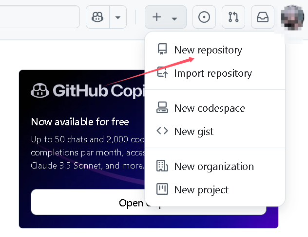
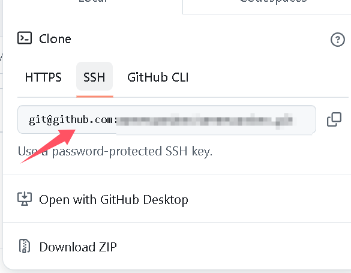

# GIT入门手册

> 前言:
>
> ​			菜鸟入门手册
>
> -2025/2/25

## GIT

### 基础

> 2025/2/26

​	[GIT入门学习链接B站]( https://www.bilibili.com/video/BV1MU4y1Y7h5/?p=16&share_source=copy_web&vd_source=e5861445f9c26cabd257b6321c7268ff)


​	git工作目录是指除.git文件外的所有文件


​	未暂存，未跟踪，已暂存，提交

​	

​	add-->进入暂存区

​	commit-->进入仓库

#### 配置个人信息

```
git config --global user.name 'yourname'
git config --global user.email 'youremail'
```

#### 常用命令

查看修改状态

```
git status
```

查看提交日志

```
git log[option]
```

<!--[option]: 																								      			1.--all 显示所有分支																							2. --pretty = oneline 将提交信息显示为一行																				3. -- abbrev-commit 使得输出的commit更简短																			4. -- graph 以图的显示-->

版本回退

```
git reset --hard commitID
```

<!--commitID 可以使用git log查看 -->

<!-- 查看已经删除的提交记录 git reflog-->

可以通过创建一个名为,gitignore的文件，列出要忽略的文件模式。

```
touch .gitignore
```

### 分支

> 2025/2/26

#### 查看分支

```
git branch
```

#### 创建新的分支

```
git branch 分支名
```

<!--实际工作中，一次只能对一个分支修改！这个被修改的分支成为当前分支，工作区为一个分支服务！-->

#### 切换分支

```
git checkout 分支名
```

#### 切换并创建分支

````
git checkout -b 分支名
````

#### 删除分支

需要做检查

```
git branch -d 分支名
```

强制删除

```
git branch -D 分支名
```

#### 合并分支

先切换到当前分支

```
git merge 要被合并的分支名
```

退出编辑模式，ESC + :wq

#### 查看本地分支与远端分支关系

```
git branch -vv
```


#### 开发中的分支使用原则和流程

​	几乎所有的版本控制系统都以某种形式支持分支，使用分支意味着你可以把你的工作从开发主线上分离开来进行重大的bug修改、开发新的功能，以免影响开发主线。

​	在实际开发中，一般有如下分支使用原则和流程：

- master（生产）分支

​	线上分支，主分支，中小规模项目作为线上运行的应用所对应的分支

- develop（开发）分支

​	是从生产分支创建的分支，一般作为开发部门的主要开发分支，如果没有其他并行开发不同期上线要求，都可以在此版本进行开发，阶段开发完成后，需要合并到生产分支，准备上线

- feature/xxx分支

​	从开发分支创建的分支，一般是同期并行开发，但不同期上线时创建的分支，分支上研究的研发任务完成后合并到开发分支

- hotfix/xxx分支

​	从生产分支派生的分支，一般作为线上bug修复使用，修复完成后需要合并到master、test、develop分支

- 其他分支，如test（用于代码测试），pre（预上线）等等。


### 解决冲突

> 2025/2/26

#### 合并冲突

一般都是修改了同一文件的同一行，这时候需要手动解决冲突：

1. 处理文件中冲突的地方
2. 将解决完冲突的文件加入暂存区
3. 提交到仓库

### GIT远程仓库

> 2025/2/26

##### 常用的托管服务

​	github，gitee，gitlab

​	gitlab常用于企业等，因其本地部署，所以保证安全


### SSH配置步骤

> 2025/2/25

#### 生成SSH密钥/创建密钥对

```
ssh-keygen -t rsa -C 'youremail' -f ~/.ssh/id_rsa
```

 <!-- -t rsa :使用rsa算法生成密钥  -->

<!--  -c :添加备注，通常为你的邮箱	也就是说-c及其后面可以不要 **这里的C必须大写**-->

<!--  -f :指定密钥位置，后面的为默认地址，通常可以不改 -->

会出现如下两行：

Enter file in which to save the key(C:\Users\yourusername/.ssh/id_rsa):

**Enter passphrase (empty for no passphrase) :**

<!--输入的密码是对密钥的二次认证，如果你的私钥泄漏了，没有这个密码依然没用！-->

#### 密钥对位置

​	一般在你的C盘，用户，用户名，.ssh

​	里面分为pub公钥和你的私钥

#### 添加公钥到远程仓库

进入github，点击右上角，寻找setting


如果你有密码，验证即可。

#### 测试连接

测试github

``` 
ssh -T git@github.com
```

### 创建仓库和提交本地仓库给远程

> 2025/2/25

#### 创建仓库




建好后，在github上，有一个空白远程库。

#### 将本地库上传

##### 初始化

打开项目所在文件夹,如果发现并没有.git文件，需要在项目文件中打开cmd,

打开后输入如下：

此为将项目文件初始化

```
git init
```

##### <a href ="" name = "1" >将项目提交到暂存区</a>

```
git add 文件名
```

第一次提交可以如下:

```
git add .
```

##### <a href ="" name = "2" >提交到本地仓库</a>

```
git commit -m "说明"
```

##### 链接本地库和远程库

```
git remote add 别名 URL
```

这里的URL为

​	别名一般默认为orgin

##### 测试是否链接成功

```
git remote
```

结果会出现你输入的别名

##### <a href ="" name = "3" >将本地库上传</a>

```
git push URL的别名 分支名
```

这里如果只是测试，可以如下：

```
git push URL的别名 master
```

完成后即可在你的github仓库里看到内容

但其实完整格式如下：

```
git push [-f] [--set-upstream][远端名称（别名）[本地分支名][:远端分支名]]
```

<!--其中-f是强制覆盖-->

<!--其中--set-upstream是建立本地分支与远端分支的关联关系，建立后可以省略调远端名和分支名直接push推送-->

如果想要再一次上传文件，需要三步走：

<a href = "#1" >将项目提交到暂存区</a>	

<a href = "#2" >提交到本地仓库</a>

<a href = "#3" >将本地库上传</a>

### 将远程仓库拉到本地

##### CLONE

```
git clone URL
```

##### 抓取

```
git fetch [remote name] 	[branch name]
```

​	抓取指令就是将仓库里的更新都抓取到本地，不会进行合并

##### 拉取

```
git pull [remote name] 	[branch name]
```

​	拉取指令就是将远端仓库的修改拉到本地并自动合并，等同于fetch+merge

### 团队开发模式流程

​	当我们进入团队开发模式的时候，一般流程如下：

1. 由组长，基于本项目创建本地仓库和远程仓库，并推送项目到远程仓库
2. 每一位组员从远程仓库克隆项目到IDE中后开始正式开发
3. 组员A修改工作区提交到本地仓库后再推送至远程仓库，其余人可以直接从远程仓库中获取最新代码
4. 如果产生了合并冲突，则需要解决冲突后再推送到远程仓库

#### <font color = red>注意事项</font>

1. **切换分支前需提前提交本地的修改**
2. 代码及时提交，提交过了就不会丢
3. 遇到任何问题都不要删除文件目录，第一时间找人解决

