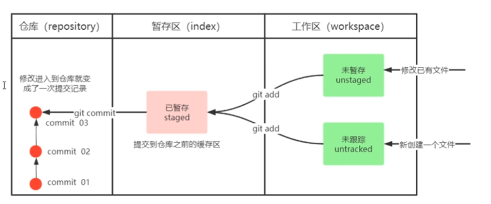
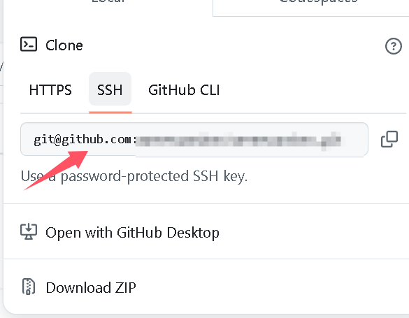

# 工作手册

> 前言:
>
> ​			菜鸟入门手册
>
> -2025/2/25

## GIT

### 基础

> 2025/2/26

​	[GIT入门学习链接B站]([黑马程序员Git全套教程，完整的git项目管理工具教程，一套精通git_哔哩哔哩_bilibili](https://www.bilibili.com/video/BV1MU4y1Y7h5?spm_id_from=333.788.videopod.episodes&vd_source=6c36f95986b70a9911efc79eb435327f))

​	git工作目录是指除.git文件外的所有文件


​	未暂存，未跟踪，已暂存，提交

​	

​	add-->进入暂存区

​	commit-->进入仓库

#### 配置个人信息

```
git config --global user.name 'yourname'
git config --global user.email 'youremail'
```


### SSH配置步骤

> 2025/2/25

#### 生成SSH密钥/创建密钥对

```
ssh-keygen -t rsa -C 'youremail' -f ~/.ssh/id_rsa
```

 <!-- -t rsa :使用rsa算法生成密钥  -->

<!--  -c :添加备注，通常为你的邮箱	也就是说-c及其后面可以不要 **这里的C必须大写**-->

<!--  -f :指定密钥位置，后面的为默认地址，通常可以不改 -->

会出现如下两行：

Enter file in which to save the key(C:\Users\yourusername/.ssh/id_rsa):

**Enter passphrase (empty for no passphrase) :**

<!--输入的密码是对密钥的二次认证，如果你的私钥泄漏了，没有这个密码依然没用！-->

#### 密钥对位置

​	一般在你的C盘，用户，用户名，.ssh

​	里面分为pub公钥和你的私钥

#### 添加公钥到远程仓库

进入github，点击右上角，寻找setting


如果你有密码，验证即可。

#### 测试连接

测试github

``` 
ssh -T git@github.com
```

### 创建仓库和提交本地仓库给远程

> 2025/2/25

#### 创建仓库


建好后，在github上，有一个空白远程库。

#### 将本地库上传

##### 初始化

打开项目所在文件夹,如果发现并没有.git文件，需要在项目文件中打开cmd,

打开后输入如下：

此为将项目文件初始化

```
git init
```

##### <a href ="" name = "1" >将项目提交到暂存区</a>

```
git add 文件名
```

第一次提交可以如下:

```
git add .
```

##### <a href ="" name = "2" >提交到本地仓库</a>

```
git commit -m "说明"
```

##### 链接本地库和远程库

```
git remote add 别名 URL
```

这里的URL为

##### <a href ="" name = "3" >将本地库上传</a>

```
git push URL的别名 分支名
```

这里如果只是测试，可以如下：

```
git push URL的别名 master
```

完成后即可在你的github仓库里看到内容

如果想要再一次上传文件，需要三步走：

<a href = "#1" >将项目提交到暂存区</a>	

<a href = "#2" >提交到本地仓库</a>

<a href = "#3" >将本地库上传</a>


